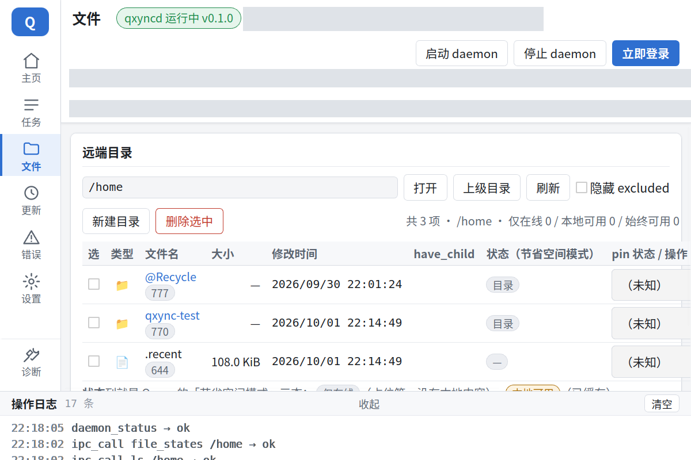
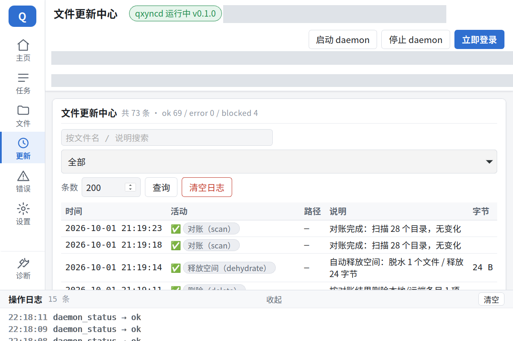
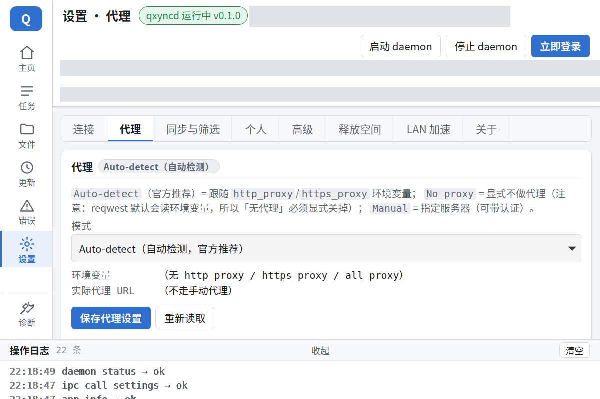

# qxync — Qsync for Linux (with on-demand sync)

[](https://github.com/mlzxgzy/qxync/actions/workflows/ci.yml)
[](#license)
[](Cargo.toml)
[](#quick-start)

[中文](README.md) · **English** · [Disclaimer](DISCLAIMER.md) · [Changelog](CHANGELOG.md) · [Acceptance log](docs/验收记录.md)

A **third-party QNAP Qsync client for Linux**, written in Rust + FUSE, whose core is
**on-demand sync**: a file on the NAS is merely a "placeholder" locally — `ls -l` shows its
real size with **zero download**, and only the range you actually read gets fetched;
anything you don't want to keep can be **dehydrated** back into a placeholder, so local disk
usage stays under your control at all times.

> ⚠️ **Only for QNAP NAS devices that you own or are explicitly authorized to use.**
> This project **does not distribute** any QNAP binary, installer, or decompiled artifact, and
> **does not circumvent** any licensing or technical protection measure. It is
> **in no way affiliated with QNAP Systems, Inc.** See the
> **[Disclaimer](DISCLAIMER.md)** for the full terms.

---

## What this is

A **Qsync client that runs on Linux**, made up of three binaries:

| Binary | Role |
|---|---|
| `qxync` | Command line (login / list / upload & download / mount / sync / dehydrate / tasks / settings / logs / LAN peering) |
| `qxyncd` | Long-running daemon: the **only** process holding the FUSE mount and the NAS session, exposing a local unix-socket JSON IPC |
| `qxync-gui` | Tauri 2 desktop app (dependency-free static frontend, everything goes through the daemon's IPC) |

**What it is**: an **interoperability implementation** of the behaviour exhibited by QNAP's
official client — the protocol details come from static reverse engineering of
**Qsync for Windows v6.1.0.0831**, and every conclusion was verified
against a real NAS.

**What it is not** (the scope, stated explicitly):

- ❌ **Not** the official client, and it does not represent QNAP's position ([Disclaimer](DISCLAIMER.md))
- ❌ Does **not** implement cloud account / QID / myQNAPcloud login: the one and only supported path is "a local account talking straight to the NAS"
- ❌ Does **not** interoperate with the official client's binary WebSocket channel (its wire format was not recovered), so LAN acceleration is qxync's own qxync↔qxync protocol
- ❌ Does **not** write the NAS device list, does no device registration, and modifies no NAS-side configuration whatsoever
- ❌ No Windows / macOS support (FUSE and `/proc` semantics are Linux-only)

## What it can do today

| Capability | Description | Docs |
|---|---|---|
| **On-demand hydration** | placeholder + **128 KiB range** downloads on demand (`head -c 100 big.bin` fetches exactly 1 range, not the whole file) | [M1.5](docs/M1.5-设计.md) |
| **Cache first** | content already on disk is **adopted as-is** (the hydration bitmap is persisted next to it), so a cache-hit `cat` makes **zero NAS round trips**; `ls`/`lookup` are served from a local snapshot of the NAS file list (refreshed on a timer) instead of waiting on the network every time | [M9](docs/M9-缓存优先与映射.md) |
| **Session self-healing** | the sid is **hot-swappable**: on an auth failure a mount asks the daemon to log in again, takes the new sid and retries in place; a successful login **pushes the new sid to every mount of the same account**, with a periodic keepalive as a safety net (no more "sid expires → EIO until remount") | [M10](docs/M10-会话热更新.md) |
| **Read-write mount** | after `--rw`, local changes are pushed back to the NAS through an upload queue; writes are **read-modify-write**, so a range that was never fetched is never uploaded as zeros | [M2b](docs/M2b-写路径.md) |
| **Deleting** | `unlink`/`rmdir` **return immediately**; the remote delete is pushed by a background queue that **coalesces same-directory items into one request** (the official Smart Delete shape); survives crashes; bulk accidental deletes are still stopped by the **circuit breaker** | [CHANGELOG](CHANGELOG.en.md) |
| **No trash bin on the mount point** | when the desktop (KDE Dolphin's `trash:` protocol) tries to create `.Trash-$UID` inside the mount, it is rejected — deleting a file really deletes it | [CHANGELOG](CHANGELOG.en.md) |
| **Change discovery** | three-cursor polling + three-way baseline reconciliation; conflicts produce a **conflicted copy**, and bulk remote deletes are guarded by a **circuit breaker** | [M2c](docs/M2c-变更发现.md) |
| **Dehydration (free up space)** | the full safety-check chain (pin / unuploaded changes / open fd / mmap'd / currently hydrating / recently accessed) must pass before local content is dropped | [M3](docs/M3-脱水.md) |
| **Local state store** | SQLite carries cursors / baseline / pin / upload queue, persisted in **one and the same transaction**; librsync-compatible delta codec + capability gating | [M5](docs/M5-SQLite与delta.md) |
| **Shared folders** | NAS folders are paired **one-to-one** onto local folders; writability is decided by the NAS (folders registered as Qsync sync folders are writable) | [M6](docs/M6-多根与共享文件夹.md) · [CHANGELOG](CHANGELOG.en.md) |
| **Selective sync** | gitignore-flavoured `exclude` rules (anchoring / `**` / negation / subtree pruning) + built-in temporary-file filtering | [M7](docs/M7-选择性同步与LAN直连.md) |
| **LAN direct** | qxync↔qxync peer protocol: device pairing, event fast path, direct local range transfer (any failure silently falls back to the NAS) | [M7](docs/M7-选择性同步与LAN直连.md) |
| **Sync tasks** | mount registrations persisted in `tasks/<id>.json`, pause/resume per task, restorable after a restart with `--restore-tasks` | [M8](docs/M8-向Qsync-Client-6靠拢.md) |
| **Sync log** | the `journal` table of `sync.db` plus background batched writes and rotation, driving the GUI's "File Update Center / error list" | [M8](docs/M8-向Qsync-Client-6靠拢.md) |
| **Desktop GUI** | Home / Tasks / Files / Updates / Errors / Settings / Diagnostics; tray + notifications + autostart + file picker + **"Open folder"** on task cards (opens the local mount point with the desktop's default directory tool) | [M4](docs/M4-GUI.md) · [M8](docs/M8-向Qsync-Client-6靠拢.md) |
| **Settings center** | three proxy modes (Auto-detect / No proxy / Manual), automatic space freeing, five conflict policies, three file states | [M8](docs/M8-向Qsync-Client-6靠拢.md) |

## Screenshots

> The screenshots below show a **redacted** UI (real NAS addresses and local paths have been painted over).

| Home | Files |
|---|---|
|  |  |

| File Update Center | Settings · Proxy |
|---|---|
|  |  |

## Quick start

### 1. Dependencies

- **Rust 1.90+** (see `rust-version` in [`Cargo.toml`](Cargo.toml))
- **FUSE 3**: the kernel's `/dev/fuse` + `fusermount3` (installing `fuse3` is enough on most distributions)
- **The GUI additionally needs** the WebKitGTK 4.1 and GTK 3 development packages
  (e.g. `libwebkit2gtk-4.1-dev` + `libgtk-3-dev` on Debian/Ubuntu;
  see the Prerequisites section of the official Tauri 2 documentation for the full list per distribution)
- The frontend is the **dependency-free static trio** under `crates/qxync-gui/ui/`, so **no npm / bundler is needed**

### 2. Build

```bash
git clone https://github.com/mlzxgzy/qxync.git
cd qxync
cargo build --workspace           # debug
cargo build --workspace --release # release (lto=thin is already configured; line numbers in backtraces are kept so bug reports stay useful)
```

If you want `.deb` / AppImage packages, `crates/qxync-gui/tauri.conf.json` already sets
`bundle.targets = ["deb", "appimage"]` — just package with the Tauri CLI.

**Prebuilt artifacts**: pushing a `v*` tag (or manually running the `Release` workflow) makes
[`.github/workflows/release.yml`](.github/workflows/release.yml) build and attach them to the
matching [Release](https://github.com/mlzxgzy/qxync/releases):

| Asset | What it is |
|---|---|
| `qxync-<version>-x86_64-unknown-linux-gnu.tar.gz` | all three binaries + desktop entry / icons + licences / disclaimer |
| `qxync-bin-<version>-1-x86_64.pkg.tar.zst` | the **Arch package** (built by CI with the real `makepkg` from the archlinux image, out of the tarball above) |
| `qxync` · `qxyncd` · `qxync-gui` | the three binaries on their own, from the same build |
| `SHA256SUMS` | checksums for the assets above |

Just keep the three binaries in the **same directory**: the GUI first looks for `qxyncd` next to
itself and only then falls back to `PATH`. Running the GUI also needs the WebKitGTK 4.1 / GTK 3
runtime (`libwebkit2gtk-4.1-0` + `libgtk-3-0` on Debian/Ubuntu). **Building from source is still
the recommended path** (reproducible and auditable).

**Arch Linux**: each release ships a ready-made `qxync-bin-<version>-1-x86_64.pkg.tar.zst` —
install it with `sudo pacman -U`. The repo also carries an AUR package definition
([`packaging/arch/PKGBUILD`](packaging/arch/), package name `qxync-bin`) so you can run
`makepkg -si` yourself; once it is published to the AUR it is `yay -S qxync-bin`. The package is
**intentionally not stripped** (readable backtraces, see above), so it installs ~190 MB — see
[`packaging/arch/README.md`](packaging/arch/README.md) for details and the checksum bump after
each release.

### 2.5 Upgrading from 0.1.x (the rename)

On 0.1.x the command line was called `qsync`, which fought the **official QNAP Qsync client**
for the same name in `PATH`; from 0.2.2 it is `qxync`. The full list is in the
[CHANGELOG](CHANGELOG.en.md#022---2026-10-02).

On the first run after upgrading, the local directories are **migrated automatically**:
`~/.config/qsync`, `~/.local/share/qsync` and `~/.local/state/qsync` are renamed to their
`qxync` counterparts (falling back to a copy across filesystems), so credentials, the state
database and logs come along — **no need to `login` again**. If both the old and the new
directory exist (for example an early prototype's `~/.local/share/qxync`), only the entries
**missing** from the new directory are filled in, **nothing already there is overwritten**, and a
note prints both paths. The only things you must update are your own scripts:

| Old (0.1.x) | New (0.2.2+) |
|---|---|
| `qsync …` | `qxync …` |
| `QSYNC_PASSWORD` / `QSYNC_HOST` / `QSYNC_USER` / `QSYNC_SOCKET` | `QXNYC_PASSWORD` / `QXNYC_HOST` / `QXNYC_USER` / `QXNYC_SOCKET` |
| `QSYNC_TEST_*` (acceptance matrices) | `QXNYC_TEST_*` |
| `getfattr -n user.qsync.state` | `getfattr -n user.qxync.state` |

> **Where the line is drawn**: only **our own** identifiers changed. The NAS protocol surface is
> untouched — `cgi-bin/qsync/qsyncsrv.cgi`, `qsync_version`, `service=Qsync`,
> `WFM_QSYNC_DISABLED` and friends are exactly as before.

> **The daemon does not need a login to start**: with no connection configured `qxyncd` goes into
> **idle standby** (the UI shows "not configured", and `qxync daemon status` reports the link as
> unconfigured); as soon as a connection is saved it switches to sync mode by itself — so
> "run the daemon in the background now" and "log in later" are no longer in conflict.

### 2.6 Upgrading from 0.2.x (one-to-many is gone)

**0.3.0 is a breaking release**: "one mount point / one task against several NAS folders" is no
longer supported. What was removed and why is in the [CHANGELOG](CHANGELOG.en.md#030---2026-10-02)
and [release notes v0.3.0](docs/发布说明-v0.3.0.md). There is very little to change:

| Old (≤0.2.3) | New (0.3.0+) |
|---|---|
| `qxync mount ~/mnt --remote /home --remote /Public` | create two mounts, or two tasks (one mount point = one NAS folder) |
| `"roots": ["/home"]` in a task JSON | `"root": "/home"` (a single `roots` entry migrates automatically; **several are reported as a bad task file**, telling you to split the task) |
| `roots` / `home_root` in the link config | both are gone (unknown fields are ignored); the home directory is fixed to `/home` in the Qsync protocol |
| the Connection page "Advanced" section | removed; the form is host/port/user/password/https/insecure/ipv4-only |

Nothing on the NAS — data, cache, baseline, credentials — is affected. If a multi-root mount is
still mounted, `qxync umount <mountpoint>` before upgrading, then re-create it one-to-one.

### 3. First login

Credentials are written to `~/.config/qxync/credentials.json` (mode `0600`).

```bash
cargo run -p qxync-cli -- \
  --host <your-NAS> --port 9834 --insecure \
  --user <user> --password '<password>' login
```

> `--insecure` = accept self-signed certificates. **Keep the password out of your shell history**:
> `--password` can also be replaced by the `QXNYC_PASSWORD` environment variable.

### 4. Mount the on-demand sync view

```bash
cargo run -p qxync-cli -- daemon start            # bring up qxyncd (idempotent)
mkdir -p ~/qxync-mnt
qxync mount ~/qxync-mnt --remote /home            # the FUSE mount is held by the daemon (read-only by default)
qxync mount ~/qxync-mnt --remote /home --rw       # add --rw when you need writes to go back

ls -l ~/qxync-mnt/qxync-test          # real size, nothing downloaded yet
cat ~/qxync-mnt/qxync-test/hello.txt  # the first read triggers on-demand hydration (only the ranges needed)
getfattr -n user.qxync.state ~/qxync-mnt/qxync-test/hello.txt   # placeholder / partial / hydrated

qxync dehydrate --path /home/qxync-test/big.bin   # dehydrate: drop the local content, keep only a placeholder
qxync umount ~/qxync-mnt
qxync daemon stop                                 # clean exit: unmount everything + delete socket/pid
```

> **You can start the daemon before configuring anything**: with no connection configured it goes
> into **idle standby** (alive but doing nothing; the UI shows "not configured") and switches to
> syncing by itself once a connection is saved — so "run it in the background now, log in later"
> is no longer a conflict.

#### 4.1 Keep it running with systemd (recommended)

`packaging/systemd/qxyncd.service` is a **user unit**; if you installed the package it lives at
`/usr/lib/systemd/user/qxyncd.service`:

```bash
systemctl --user enable --now qxyncd     # start at login (and start it now)
systemctl --user status qxyncd
journalctl --user -u qxyncd -f           # logs (the daemon's stderr goes to journald)
systemctl --user stop qxyncd             # graceful stop: unmount FUSE + remove socket/pid
sudo loginctl enable-linger "$USER"      # only if you want it up without an active login
```

> Once the unit is in use, **stop managing the daemon with** `qxync daemon start` /
> `qxync daemon stop` — that path is for systems without systemd, and using both at once only
> makes them fight (`qxync daemon stop` exits via IPC, so systemd sees its main process vanish).

### 5. GUI

```bash
cargo build -p qxync-gui
qxync daemon start
./target/debug/qxync-gui

# headless self-test (for scripts / CI; exit code 0 while the daemon is running)
./target/debug/qxync-gui --self-test
./target/debug/qxync-gui --self-test-login   # additionally runs the whole "save and log in" chain (restarts the daemon)
```

The left edge of the window is an icon bar: **Home / Tasks / Files / Updates / Errors / Settings / Diagnostics**.
The GUI issues no HTTP itself — **everything goes through the daemon's IPC**.

The **"Open folder"** button on a task card opens that task's local mount point with the
**default file manager you configured for directories** (KDE Dolphin / GNOME Files / Thunar…):
it looks up the desktop entry via `xdg-mime`, then resolves the *real* executable from that
entry's `Exec=` line before launching (the ID `xdg-mime` prints is not an executable — running
it as-is fails). With no default directory handler configured, it falls back to the `xdg-open`
chain. See [`docs/M4-GUI.md`](docs/M4-GUI.md) §4.1.1.

### 6. Common commands cheat sheet

```bash
qxync status                     # session + server + cursors + hydration stats + mounts
qxync ls /home                   # list a directory (auto-paginates)
qxync store [--integrity|--json] # state-store snapshot (cursors / baseline / pin / upload queue)
qxync roots [--json]             # sync folders registered on the NAS (the NAS folders you can pair)
qxync rules [--match <path>]     # selective-sync rule verdict (visible / excluded / temp / outside-roots)
qxync sync [--once]              # change-discovery status; --force-deletes releases bulk deletes
qxync task list|add|pause|resume|rm
qxync journal [--level error]    # sync activity log (--level error is exactly the "error list")
qxync settings [--set k=v]       # proxy / autostart / notifications / free up space
qxync space [--now]              # free-up-space status / free up space now
qxync conflicts --resolve <id> --as keep_local|keep_remote|keep_both
qxync file-states /home          # three file states: online-only / locally available / always available
qxync peer status|pair|ping|events|fetch    # LAN peering (configure peer_listen in the link first)
```

All subcommands are listed in `qxync --help`; the IPC contract (unix socket + one JSON per line) is in
[`docs/M1.5-设计.md`](docs/M1.5-设计.md).

## Architecture

**Process model**: `qxyncd` is the **only** process holding the FUSE mounts and the NAS session.
`qxync` **routes automatically** by default — if the socket is reachable it goes over IPC
(`--via-daemon` forces it, `--direct` skips it), so `qxync ls /home/x` is seamless for the user.

```
qxync (CLI) ──┐
              ├─IPC(unix socket)──> qxyncd ──┬── FUSE mount (on-demand hydration / write-back / dehydration)
qxync-gui ────┘                              ├── sync engine (polling + baseline reconciliation + conflict/delete protection)
                                             └── qxync-client ──HTTP──> NAS
                                                  └── LAN peering (qxync↔qxync)
```

```
crates/
├── qxync-core/        shared types + config layout + state store (SQLite) + delta codec + single-root normalization + rule engine
├── qxync-client/      NAS HTTP API wrapper (login / metadata / upload & download) + LAN peer protocol
├── qxync-fuse/        FUSE layer: read-only/read-write mounts + range hydration + dehydration (incl. the upload queue)
├── qxync-daemon/      the qxyncd binary: long-running process + IPC server + sync engine + peer listener
├── qxync-cli/         the qxync binary: command line
├── qxync-gui/         the qxync-gui binary: Tauri 2 app (ui/ is a dependency-free static frontend)
└── qxync-proto-test/  real-NAS integration tests (#[ignore] by default, run manually)
xtask/tests/           8 acceptance matrix scripts (see "Acceptance & testing")
xtask/probe/           protocol probe tools (qs_probe / qs_fixture / nas_manifest / p0_device_probe)
docs/                  design and execution documents
DISCLAIMER.md          disclaimer and legal boundaries
```

Dependency direction (only downwards allowed): `cli → core` (plus daemon access over IPC);
`daemon → fuse/client → core`.

## Implementation notes

**Metadata never rides the data path**: `ls -l` is answered straight from NAS metadata (real size,
zero download). The cache is a sparse file whose "apparent size = file size", and only the ranges
that are read get `pwrite`-ten into it; `user.qxync.state` exposes
`placeholder`/`partial`/`hydrated`, and `user.qxync.chunks` exposes "ready / total".
Cache file names use a **stable hash of the remote path** (not the ino — the same ino can map to
different files across two mounts).

**Dehydration passes the full safety-check chain first** (`qxync-core/src/dehydrate.rs` + `qxync-fuse`/`qxyncd`):
pin=pinned/excluded, unuploaded changes / in-flight queue entries, open fds, mmap'd (scanning
`/proc/*/maps`), currently hydrating, recently accessed. Only once all of them pass does it follow
**iron rule 2**: `inval_inode(0,0)` → wipe the cached content → update the placeholder; if
`inval_inode` fails, **nothing at all is wiped**. It does **not** dehydrate automatically by default;
that is triggered by `QXNYC_DEHYDRATE_IDLE=600` (idle) / `QXNYC_CACHE_LIMIT=2G|25%` (quota, LRU),
or manually with `qxync dehydrate`. `--cache-mode direct` uses `FOPEN_DIRECT_IO` to bypass the page
cache (dehydration becomes inherently safe, at the cost of no readahead and no mmap).

**Change discovery treats baseline reconciliation as the main path**: the daemon runs a round of
"three cursors + baseline reconciliation" every 30s (`QXNYC_POLL_INTERVAL` is adjustable) — taking
the event fast path first, then falling back to "list the known directories + baseline difference".
A remote change → if the file is **hydrated** the old content stays readable while the new version is
downloaded in the background and **atomically swapped in** (until the swap, `cat` returns the complete
old version, and `stat` reports its size); if the file is **dehydrated** only metadata is refreshed;
both sides changed → a **conflicted copy** (the remote keeps the original name, the local content is
stored as `xxx (conflicted copy from <device> <date>).txt` and uploaded); bulk remote deletes →
**circuit breaker** (only `qxync sync --force-deletes` lets them through).

**State moved into SQLite** (`qxync-core/src/store.rs`): `<data>/sync/<host>/sync.db` carries the
three event cursors + baseline + **pin** (previously in memory only, so a daemon restart lost it →
the dehydration safety check silently failed open) + the upload queue.
**Cursors and baseline are persisted in the same transaction** — in the JSON era, a crash between
the two `rename` calls produced "cursor advanced, baseline not". The old
`cursors.json`/`baseline.json` are migrated automatically on first start and archived as
`*.json.migrated` (backups kept, idempotent).

**One-to-one: one mount point = one NAS folder.** The mount point *is* that folder's content
(pair `/home` and you see the home directory directly — no extra `home/` level). Cache / baseline /
pin / xattr / upload queue all key by remote path; the home directory is **fixed to `/home`** in the
Qsync protocol (it is not a config field).

> ★ 2026-10-02: **one-to-many (multi-root) mounts were removed entirely** (the `roots` config,
> `--remote A --remote B`, the FUSE virtual root, and the legacy multi-root `roots` array in task
> files). To sync several NAS folders, create several tasks — one task = one local folder + one NAS
> folder. A legacy file with a single `roots` entry migrates to `root` automatically; several
> entries are reported as a bad task file (telling you to split it) instead of silently narrowing
> the sync scope.

## Known limitations

* **The tray needs an SNI host**: qxync speaks `org.kde.StatusNotifierItem` (a ksni implementation,
  not libappindicator). It covers Plasma / waybar / polybar / XFCE (the `statusnotifier` plugin) /
  LXQt / Cinnamon / GNOME + AppIndicator extension; but **IceWM / Fluxbox / Openbox+tray / old
  XFCE·MATE panels only speak XEmbed**, and **bare GNOME supports neither protocol** — in those two
  kinds of environment the tray icon will not appear
  (you can install [`snixembed`](https://sr.ht/~steef/snixembed/) to bridge SNI into an old-style tray).
  The program **probes** whether it is genuinely visible (the watcher has a host and this process's
  item is registered); **when it is not visible, closing the window really closes it**, rather than
  hiding the window in a tray that nobody draws.
* The "last triggered" timestamp of **"free up space by frequency"** lives only in memory and restarts
  its clock when the daemon restarts ("when space is below X%" is unaffected).
* **i18n covers UI strings only**: `ui/i18n.js` is a zh-CN string table (163 entries) + a
  **reserved empty en table** (an empty table = the whole entry falls back to zh-CN, so nothing ever
  comes out blank). Diagnostic logs and the mixed-markup paragraphs with inline `<code>` in
  `index.html` are **deliberately left out of the table**. The string table is guarded by the
  two-way `ui_spec` self-check in `qxync-gui --self-test`, and **no i18n framework is introduced**.
* **In direct mode (`--direct`), editing `settings.json` only writes the file**: a running daemon must
  be restarted before it reads the new settings.
* **Capability gating rather than capability assumptions**: when the NAS has no historical versions,
  delta goes through the gate and the real path is still a whole-file transfer
  (see [`M5-SQLite与delta.md`](docs/M5-SQLite与delta.md)).
* This project has only had full real-NAS verification on
  **QNAP TS-464C / QTS 5.2.9 / Qsync QPKG 5.0.0.7 (build 20260723)**; other models/QTS versions may
  run into behavioural differences that are not covered.

## Protocol notes (pitfalls we hit)

The full evidence and exploration history are in [`docs/执行方案-M0M1.md`](docs/执行方案-M0M1.md);
these are the ones most likely to bite you while writing code:

**Login & read path**

1. **Login**: `POST /cgi-bin/authLogin.cgi`, and the body must be `serviceKey=1` + `pwd=base64(password)`.
   A plaintext password, or the `service=Qsync` written in the report, only ever yields
   `authPassed=0 / errorValue=-1`. (The authoritative reference for the login protocol is the
   frontend shipped on the NAS itself, `/cgi-bin/js/qos-core-login.js`, not the Windows binary.)
2. **`q_token` is not required**: on a real NAS `qsyncsrv_login.cgi` always returns `status:-50`, yet
   the read-only endpoints work with the QTS `sid` directly.
3. **Namespace split**: metadata goes through `/cgi-bin/qsync/qsyncsrv.cgi`;
   **byte streams go through `/cgi-bin/filemanager/utilRequest.cgi?func=download` (download) and
   `/cgi-bin/qsync/upload.php` (upload)**. `qsyncsrv.cgi?func=download` always returns `status:20` — don't use it.
4. **The upload multipart field name must be `files[]`** (blueimp style);
   `upload_and_move` / `func=upload` will not receive the file body otherwise.
5. **Spaces in the query string must be encoded as `%20`**: using `+` makes file names containing
   spaces or Chinese characters 404 (which is why this project does not use `serde_urlencoded`).
6. **`stat` needs `path=<dir>&file_name=<name>&file_total=1`**, not a full path;
   `get_list` needs `hidden_file=1` before hidden files show up.
7. **`/home` is the home-directory root of a regular user** (the real path is `/share/homes/<user>`),
   while `/home/<user>` returns `status:5`.
8. `Range: bytes=0-99` → **HTTP 206 + `Content-Range`**, so range hydration has native support.
9. **`stat` uses `exist` to test existence**: a path that does not exist still returns a placeholder
   entry (named after what you asked for, with `filesize=0`), and only `exist=0` tells them apart;
   getting this wrong makes `lookup` report false positives and `mkdir` return `EEXIST` outright.

**Write path & FUSE**

10. **Write-operation namespace split**: `rename`/`move` can only be done through FileStation
    (`utilRequest.cgi`), while `createdir`/`delete` use `qsyncsrv.cgi`; `move` must carry
    `source_total=1`, and **`dest_file` is ignored** (renaming across directories = move + rename, two steps).
11. **Read-modify-write is mandatory before a write**: before writing a placeholder, the ranges that
    will not be fully overwritten must be filled in, otherwise the ranges never fetched are 0 and a
    whole-file upload zeroes out the remote content (we hit this for real).
12. **The return value of `listxattr` must be NUL-terminated**: the kernel's
    `fuse_verify_xattr_list()` runs `strnlen` on each entry, and a missing terminator on the last
    entry makes it **judge the whole listxattr as `-EIO`** — the symptom is that `ls -l` on the entire
    directory reports "Input/output error", while `stat`/`cat` are perfectly fine. The measured
    discriminator: `size<66` returns `ERANGE` while `size>=66` returns `EIO` — that is this check firing.
13. **`attr_timeout`/`entry_timeout`/`max_read` are not fusermount mount options**; passing them to
    `-o` fails the mount outright with `unknown option`. TTLs should be passed through each
    `reply.entry/attr(&ttl, ..)`, and `max_readahead` is set in `init()`.
14. **fuser 0.17's `AutoUnmount` requires `SessionACL != Owner`** (i.e. `allow_other`, and an
    unprivileged mount additionally needs `user_allow_other` in `/etc/fuse.conf`), otherwise the
    mount fails with `auto_unmount requires acl != Owner`.
15. Inside FUSE calls, `block_on` needs a **separate runtime**, and the mount thread must not use
    `tokio::spawn_blocking` (a blocking thread carries runtime context, and calling `block_on` on
    another runtime from there panics).
16. **fuser's `mount2()` gives you no `Notifier`** → switch to `fuser::spawn_mount2()` (on the daemon
    side), which yields a `BackgroundSession` (join/unmount) + a `Notifier` (`inval_inode`).
17. When a peer publishes AAAA but the IPv6 route does not work, you get `Network is unreachable` or
    a body-decode failure mid-transfer → work around it with `--ipv4` (the client binds
    `local_address` to an IPv4 source address).

**Change discovery**

18. **`lower` in `qbox_get_sync_log` is an inclusive lower bound** (`lower=30` returns `log_id=30`)
    → advance the cursor to "the last `log_id` + 1"; when the range contains no events it returns
    **`status:-17`**, which is not a protocol error.
19. **`isfolder` in an event is `1`=directory / `2`=file / `0`=deleted entry** (not a boolean);
    `size` is a string.
20. **`filepath` is empirically empty in delete events**, and **our own CGI writes
    (upload/rename/move/delete) produce no sync log events** → change discovery must
    **treat baseline reconciliation as the main path**, with events serving only as a fast path.
    The P0 probe corrected the attribution: the cause is **not** "this machine has not done device
    pairing" (the NAS had long since had devices registered by the official client), but rather that
    for this account `qbox_get_syncing_folder_list` is `total:0` (**no sync folder was ever
    registered**); the real gate is "the path falls inside a registered sync folder", and the
    existing endpoint inventory **has no endpoint that registers a sync folder** → that road is a
    dead end, so **the conclusion that baseline reconciliation is the main path stands, and with
    stronger evidence than before**.
21. `qbox_write_log` makes `max_log` grow while no events can be fetched in the range → the cursor
    **advances only by the events actually returned**, and on `-17` it does not advance but merely
    records the fact, avoiding "the cursor advanced but the events were lost".

**Dehydration**

22. ★ **The iron rule of ordering**: `Notifier::inval_inode(ino, 0, 0)` must come **before** the
    content is wiped — otherwise stale pages in the kernel page cache make applications read old
    data. How it is accepted: after dehydrating, change the remote to **the same length with
    different content** and `cat` it; you must get the new content.
23. **mmap cannot be blocked**: Linux's `flock` does not stop mmap → you have to scan
    `/proc/*/maps` yourself. Measured addendum: mmap keeps a `struct file` alive for the mapping, and
    a process's `close(fd)` does not trigger the FUSE `release` either, so the "open fd" count is
    itself the first line of defence (the `/proc` scan is the backstop).
24. Locally written ranges must be recorded in the range table (`chunks_done`), otherwise a locally
    created or modified file is judged "has no cached content" (measured: a 16 MiB local file was
    reported as "it was a placeholder all along" when dehydrated).
25. Don't measure sparse-cache usage with `du -sb` (apparent size) — a 128 MiB sparse file comes out
    as 128 MiB; use `du -s --block-size=1` (allocated).

**State store & delta**

26. **When switching persistence, always make sure no old process is running**: while debugging we saw
    "`cursors.json` reappeared after the migration archived it", and it turned out that an **old
    binary daemon** left over from a previous session was still polling every 30s and writing JSON
    with the old code (its mtime landing exactly on the polling beat was the discriminator). That is
    why the acceptance matrix uses **a brand-new state directory** — to isolate pollution like this.
27. **`rusqlite` with `bundled`**: it ships the SQLite source, so no system `libsqlite3-dev` is needed;
    WAL leaves `-wal`/`-shm` files in the state directory, which is normal — don't clear them out as junk.
28. **Every delta format detail is a default that "must be overridden explicitly"**: librsync defaults
    to block 2048 / strong 8, whereas Qsync uses **1 MiB / 16-byte MD4**; the magics are
    `0x72730136`(sig) / `0x72730236`(delta), all **big-endian**. Get the weak checksum's
    `CHAR_OFFSET=31` slightly wrong and nothing matches.
29. **Capability probing must not mean "an endpoint exists, therefore it is supported"**: on this NAS
    all three enable bits of `versioning_probe` are 1 and `versioning_lock` even hands out a lockid,
    yet `versioning_stat_delta` always returns `exist:0` and `versioning_support` is all 0 — the real
    discriminator is "**are there historical versions**", and looking only at endpoint existence
    leads to a completely wrong conclusion.

**Shared folders & NAS folders**

30. **Whether a shared folder is writable is decided by the NAS**: as long as the account has read
    permission, a plain `sid` is enough to list / stat / download (`/Public` and `/Multimedia` both
    passed on a real NAS), and `auth_data` AES is **not** needed; but an upload requires a folder
    **registered as a Qsync sync folder**, otherwise the server answers with a vague `status:20`.
    The test is "is it in `qbox_get_syncing_folder_list`", **not** "is it the home directory" —
    registered folders outside home are writable too. So the client **does not pre-judge**: tick
    read-write and it mounts read-write; if the server refuses, its own message lands in the error
    list.
31. **The top-level share list cannot be enumerated**: `get_list /` returns `status:5` for a regular
    user; the only enumerable source is `qbox_get_syncing_folder_list` (folders registered for sync
    on the NAS) → the "NAS folder" must be **chosen by the user** (dropdown + level-by-level `ls`
    browsing + manual entry), never auto-discovered. An endpoint returning 200 with an empty array
    is not an error.
32. **One-to-one**: one mount point = one NAS folder. "One-to-many" was **removed entirely** on
    2026-10-02 (the `roots` config, the multi-root virtual root, the legacy multi-root array in task
    files); see the CHANGELOG for why and what it affects.
33. **Parse real-NAS fields as they really are**: `qbox_get_syncing_folder_list` returns
    `name` / `path` / `privilege`, not the imagined `folder` / `permission` the early parser read —
    reading the wrong fields turns "listable" into "cannot list", leaving a working feature unused.

## Two iron rules

The whole project **must not violate** these two:

1. **Every `read()` must return real data or an explicit `EIO` — never a short read.**
   A short read = the kernel zero-fills → silent data corruption. Measured: a failed or timed-out
   hydration makes `cat` get `EIO` and **output 0 bytes** — it does not hang and it does not emit
   fake data.
2. **Every dehydration must first `inval_inode` to invalidate the kernel cache, and only then wipe
   the content.** Reverse that order = data corruption.

## Acceptance & testing

Every criterion was produced against a real NAS and a real mount, the scripts live in `xtask/tests/`,
and **each one can be re-run on your own NAS**. Milestone-level results are in
[`docs/验收记录.md`](docs/验收记录.md).

```bash
cargo test --workspace                                   # unit tests + doc tests (no NAS needed)

xtask/tests/fuse-matrix.sh            # 68 items: range hydration / write path / change discovery / dehydration / state store (~12min)
xtask/tests/fuse-matrix.sh --big      #    adds a 128 MiB full read + concurrent dedup
xtask/tests/m5-matrix.sh              # 30 items
xtask/tests/m7-matrix.sh              # 60 items (rules / FUSE filtering / LAN pairing·events·direct transfer)
xtask/tests/m7-matrix.sh --no-nas     #    no NAS needed: unit tests + loopback between two real daemons
xtask/tests/m82-matrix.sh             # 37 items (task registration / restart recovery)
xtask/tests/pair-1to1.sh              # 17 items (one-to-one pairing + destination conflicts; no NAS needed)
xtask/tests/m83-matrix.sh             # 27 items (journal schema migration / filtering / rotation)
xtask/tests/m84-matrix.sh             # 92 items (settings / proxy / tray / free up space / conflict policy)
xtask/tests/gui-matrix.sh             # 148 items (real-window screenshots of 9 destinations + ui_spec static self-check)
xtask/tests/gui-matrix.sh --no-window #    machines without DISPLAY run the self-check only
```

**Most recent full run: all 491 items pass** (fuse 68 · gui 148 · m5 30 · m6 29 · m7 60 · m82 37 · m83 27 · m84 92).

Real-NAS integration tests (`#[ignore]`, needing your own NAS credentials):

```bash
export QXNYC_TEST_HOST=... QXNYC_TEST_PORT=9834
export QXNYC_TEST_USER=... QXNYC_TEST_PASSWORD='...'
export QXNYC_TEST_FIXTURE=/home/qxync-test
cargo test -p qxync-proto-test -- --ignored --test-threads=1 --nocapture  # 5 protocol items + 1 IPC end-to-end item
cargo test -p qxync-daemon -- --ignored --test-threads=1 --nocapture     # M2c engine (conflicted copy / delete protection)
```

> **Restricted environments**: if `~/.cargo` / `~/.config` are not writable, use paths inside the workspace:
> `CARGO_HOME=$PWD/.cargo-home cargo build --workspace`,
> `XDG_CONFIG_HOME=$PWD/.local-run/config XDG_DATA_HOME=$PWD/.local-run/data`.

## Documentation index

| Document | Contents |
|---|---|
| [`docs/开发规划.md`](docs/开发规划.md) | First (MVP) plan |
| [`docs/执行方案-M0M1.md`](docs/执行方案-M0M1.md) | Revised after real-NAS verification: measured facts + corrections + execution order + risk gates |
| [`docs/M1.5-设计.md`](docs/M1.5-设计.md) | daemon / IPC contract, lifecycle, pin semantics, acceptance criteria |
| [`docs/M2b-写路径.md`](docs/M2b-写路径.md) | Write path: real-NAS write API contract, the read-modify-write iron rule, upload queue |
| [`docs/M2c-变更发现.md`](docs/M2c-变更发现.md) | Three-cursor/event contract, three-way decision table, conflicted copy, delete protection |
| [`docs/M3-脱水.md`](docs/M3-脱水.md) | Safety-check chain, the `inval_inode` ordering iron rule, idle/quota, cache-mode |
| [`docs/M9-缓存优先与映射.md`](docs/M9-缓存优先与映射.md) | the NAS → cache → mapping model, the persisted hydration bitmap and cache adoption, directory-listing snapshots, remote-change semantics and the on-device latency comparison |
| [`docs/M10-会话热更新.md`](docs/M10-会话热更新.md) | sid hot-update, in-place retry on auth failure, pushing re-logins to mounts, session keepalive, and the on-device logout reproduction |
| [`docs/M4-GUI.md`](docs/M4-GUI.md) | GUI boundaries, command surface, page structure, acceptance and pitfalls |
| [`docs/M5-SQLite与delta.md`](docs/M5-SQLite与delta.md) | State-store schema/migration/single transaction, real-NAS versioning probing, delta capability gating |
| [`docs/M6-多根与共享文件夹.md`](docs/M6-多根与共享文件夹.md) | **Historical**: multi-root layout (removed), read-only rules, real-NAS shared-folder probing |
| [`docs/M7-选择性同步与LAN直连.md`](docs/M7-选择性同步与LAN直连.md) | exclude rule engine, peer protocol wire format, event fast path, direct transfer |
| [`docs/M8-向Qsync-Client-6靠拢.md`](docs/M8-向Qsync-Client-6靠拢.md) | GUI rework research + M8.1–M8.6 execution plan and decision log |
| [`docs/验收记录.md`](docs/验收记录.md) | Milestone-level acceptance conclusions (what was run, what the result was) |
| [`docs/发布清单-v0.1.0.md`](docs/发布清单-v0.1.0.md) | Pre-release checklist (for maintainers) |
| [`CHANGELOG.md`](CHANGELOG.md) | Changelog |

## Security & privacy

- **Credentials**: `~/.config/qxync/credentials.json` (`0600`); the IPC socket directory is `0700` and the socket is `0600`.
- **This project collects and reports no telemetry whatsoever**, and connects to no host other than the NAS you configured and (optionally) LAN peers.
- **LAN peering is plaintext TCP**, so enable it only on a trusted LAN; the token authorizes only "read already-hydrated files + submit events" and has **no ability whatsoever to write to or delete from the remote**.
- **This project contains and distributes no third-party client credentials.** The protocol probe
  tools ([`xtask/probe/`](xtask/probe/)) use **your own** NAS account only, and raw responses land in
  `xtask/probe/probe-out/` (gitignored — **they contain sids and account names, never commit them**).
- **The repository contains no real host names, accounts or device fingerprints** (a unified scrub was done before release, see
  [`docs/发布清单-v0.1.0.md`](docs/发布清单-v0.1.0.md)).

If you find a security problem, please **do not open a public Issue** — see [`SECURITY.md`](SECURITY.md).

## Contributing

See [`CONTRIBUTING.md`](CONTRIBUTING.md). One special reminder: this project has **two iron rules** (above),
so when you change the FUSE read path or the dehydration path, always include the corresponding matrix re-run results.

## License

The **original code** of this project is released under **MIT OR Apache-2.0**, at your option:

- [`LICENSE-MIT`](LICENSE-MIT)
- [`LICENSE-APACHE`](LICENSE-APACHE)

**That license covers only the original parts of this repository.** QNAP, Qsync, myQNAPcloud, QID and
other names and marks are trademarks or registered trademarks of QNAP Systems, Inc.; all rights in the
analysed software belong to it and its licensors — see [`DISCLAIMER.md`](DISCLAIMER.md)
for details.

Third-party dependencies follow their own licenses (inspectable with `cargo metadata` / `cargo deny`).
